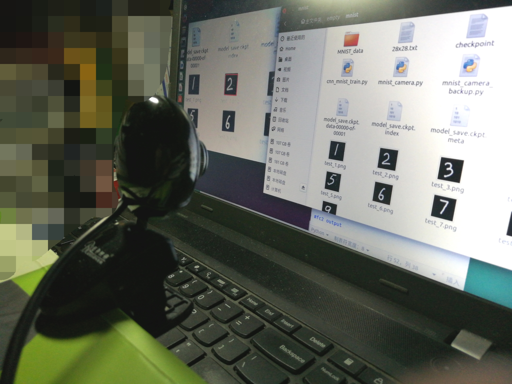
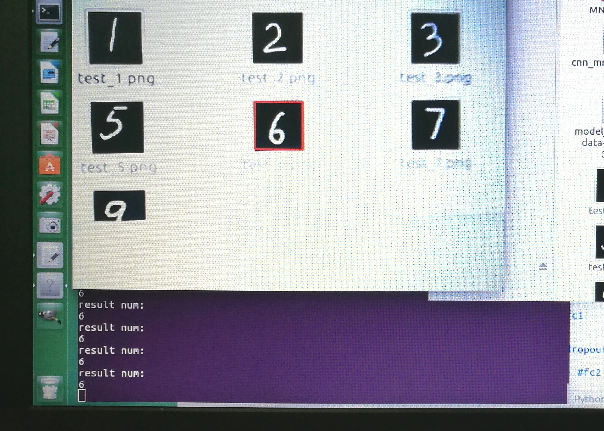
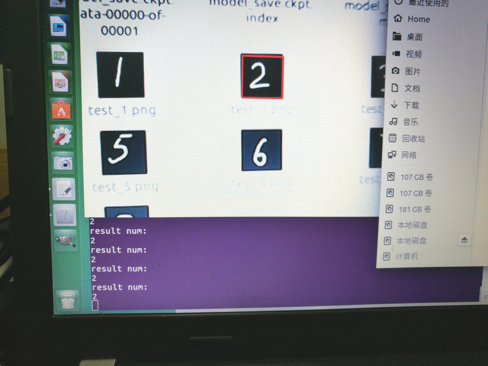

# Camera-Mnist-with-Tensorflow-OpenCV

Need:pyhton3.5,tensorflow,opencv3.x,pil(pillow),usb camera

"cnn_mnist_train.py" train mnist.

"mnist_test_opencv.py" test mnist with opencv.

"mnist_test_pil.py" test mnist with pil.

"mnist_test_camera.py" test the image captured by usb camera.

test result:

